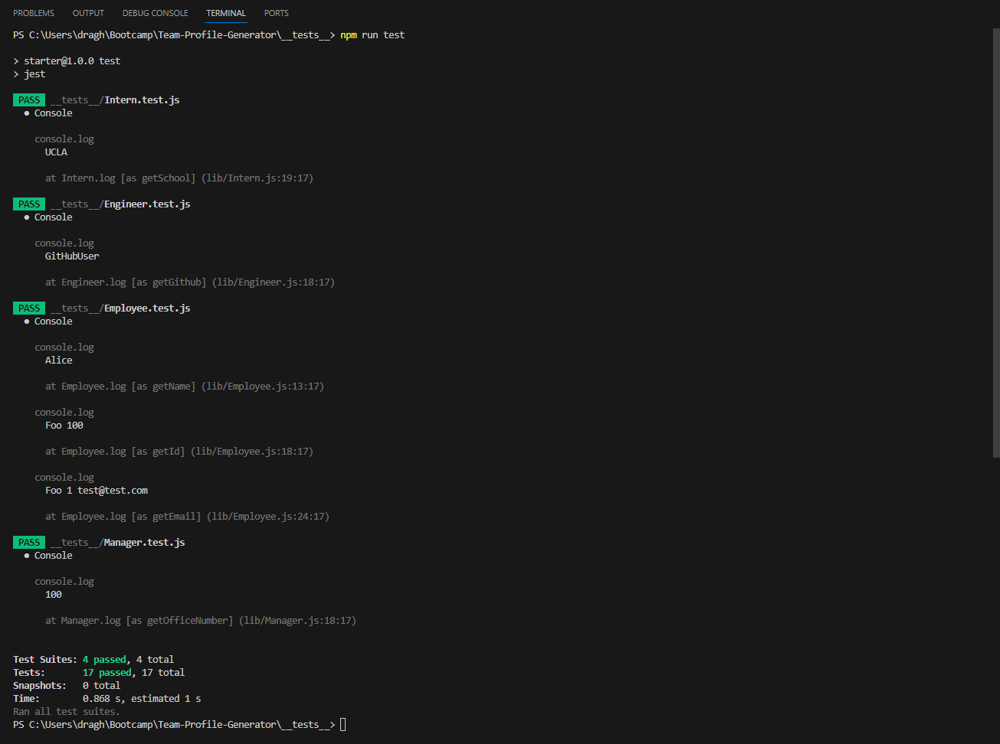
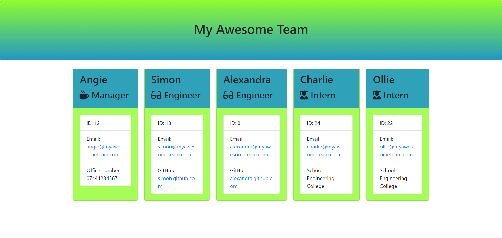

# Team Profile Generator
Week 12 Bootcamp Challenge

&nbsp;&nbsp;&nbsp;

## Description
Application that generates HTML files from a Node.js command-line interface. 

The current example applies to an engineering team where user can introduce the details of the team manager and multiple engineersor interns. Once all questions are answered and the user chooses to build the team, the application generates an HTML file to display the results.

## Table of Contents
- [Steps to create the project](#steps-to-create-the-project)
- [Installation](#installation)
- [Usage](#usage)
- [License](#license)
- [Contributing](#contributing)
- [Tests](#tests)
- [Questions](#questions)
- [References](#references)
- [Sample Application Screenshot](#sample-application-screenshot)

## Steps to create the project
1. Npm packages Jest and Inquirer 6.5.0 installed using `npm i` command in node.js. 
Jest is used for running the tests and Inquirer is used to collect input from the user.

2. Team member files were given classes and code was written to pass the tests from starter code provided in the __tests__ folder. Employee is the parent class while the rest of the files extend Employee. Manager, Engineer and Intern share name, id and email properties, while the fourth one differs.

3. Tests ran for each team member file and adjustment made accordingly.

4. Wrote index.js code that includes question arrays for each team member and for menu options, functions for each user menu selection using inquirer prompts, function to build the team and the initialize function to run the application. 

6. Added basic styling using css stylesheet.

5. Ran `node index.js` command in the terminal to generate the team.html file.

6. Add, commit and push the files on GitHub.

## Installation 
1. Git clone or copy the repository into your computer. 
2. Check package.json file for the required dependencies for this project. 
3. Run `npm i` and the package name to install it.
4. For Inquirer, please use version 8 or older. The current project runs version 6.5.0.
5. To run file tests, open __tests__ in integrated terminal and run `npm run test`.
6. Type `node index.js` in your terminal to run the application.

## Usage 
This Team Profile Generator creates an HTML file based on user input in Node.js command-line interface. 

Empty field input validation applies to text fields and positive number validation on the questions that require a number input. The app will not go forward if the criteria is not satisfied.

## License
This project is licensed under the MIT License.

## Contributing
The project is open for contributions. Please clone the Github repo into your computer and use the already installed packs from package.json file.

## Tests
Testing can be performed using the instructions in the Installation section.

Application passes all tests as seen in the screenshot below

## Questions
You can find my GitHub profile [here](https://github.com/GabiDragh).

For additional questions, please email me at draghici.gabi89@gmail.com.

## References
 
- [NPM inquirer package](https://www.npmjs.com/package/inquirer/v/6.5.0)
- [Jest](https://www.npmjs.com/package/jest)
- [ImgShields](https://shields.io/)
- [License badge repo link](https://gist.github.com/lukas-h/2a5d00690736b4c3a7ba)
- [Coverage Badges GitHUb Repo](https://github.com/jpb06/jest-badges-action)

## Sample Application Screenshot

